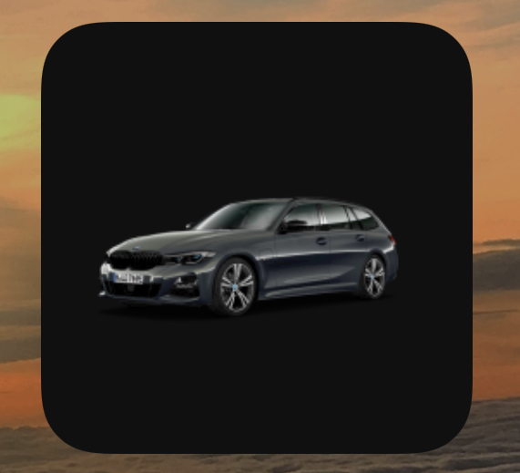
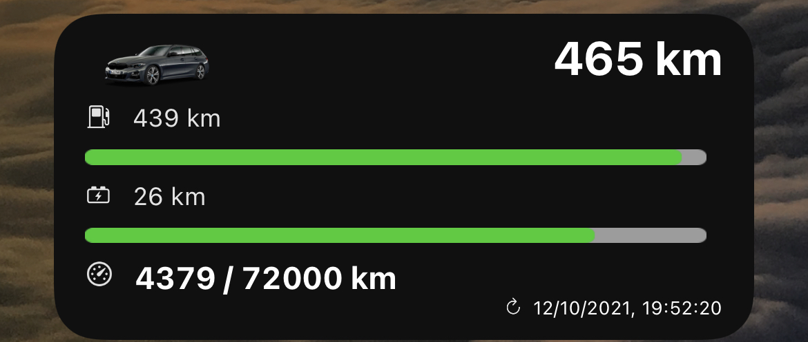

# 🚘 my-bmw-widget 📈

A JavaScript for [Scriptable](https://scriptable.app/), showing your personal data about your BMW in a widget!

## 🖥 Preview
|Small|Medium|Large|
--- | --- | ---
||||

## 🛠 How to install
### iOS
- Download the [Scriptable App](https://apps.apple.com/de/app/scriptable/id1405459188).
- Copy the folder my-bmw and the my-bmw.js into the Scriptable folder
- Open the Scriptable App and edit the my-bmw/config.js 

## ☑️ TODOS
- [ ] Create a large widget version
- [ ] Integrate more of the available data

You are very welcome to submit new ideas, feature-request and issues!

## 🔍 Find more widgets on
- [https://www.scriptables.de/](https://www.scriptables.de/)
- [https://github.com/dersvenhesse/awesome-scriptable](https://github.com/dersvenhesse/awesome-scriptable)